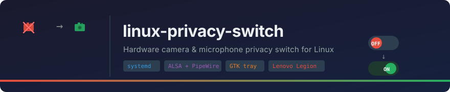

<p align="center">
  
</p>

<p align="center">
  <a href="https://github.com/prostopasta/linux-privacy-switch/blob/main/LICENSE"></a>
  
  
  
</p>

---

**linux-privacy-switch** makes the hardware privacy slider on Lenovo Legion / IdeaPad laptops actually work on Linux — muting the microphone and updating a tray indicator in sync with the camera.

**The problem:** The ITE Embedded Controller fires a key event when the slider moves, but Linux ignores it. The camera is physically cut by the EC, but the microphone stays live and no indicator updates.

**The fix:** A systemd daemon intercepts the `/dev/input/` event, detects the true camera state via V4L2 frame capture, and applies mic mute/unmute + tray icon in sync.

---

## Supported devices

| Device | DMI `product_name` | Status |
|---|---|---|
| Lenovo Legion 5 15IRX10 | 83LY | ✅ Tested |
| Lenovo Legion 5 Gen 6 (AMD) | 82JU | 🔧 Needs testing |
| Lenovo IdeaPad 5 | IdeaPad 5 | 🔧 Needs testing |

Adding a new device takes [~5 minutes](#adding-a-new-device).

---

## Quick install

```bash
git clone https://github.com/prostopasta/linux-privacy-switch.git
cd linux-privacy-switch
sudo bash install.sh
```

Detects your device by DMI, installs both systemd services, starts the tray.

```bash
bash tests/verify.sh   # post-install check
```

---

## How it works

```
Physical slider → ITE EC → /dev/input/eventN
    → privacy-switch daemon  (root, system service)
        ├── V4L2 frame capture → detect true camera state
        ├── amixer sset Capture cap/nocap         (ALSA)
        ├── wpctl set-mute @DEFAULT_AUDIO_SOURCE@  (PipeWire)
        ├── notify-send
        └── heartbeat file  every 10 s
    → privacy-tray  (user service, after graphical-session.target)
        ├── tray icon  ← polls state file every 800 ms
        └── wpctl set-volume 50%  on enable
```

### Startup sequence

On every start the daemon:

1. **Waits** until system uptime ≥ 15 s — gives the ITE EC time to apply the switch position to the camera sensor before probing.
2. **Determines initial state:**
   - *Hardware kill devices* (`has_hw_camera_kill = true`): captures one V4L2 frame. A black frame (< `nonzero_threshold` % nonzero bytes, default 3%) means the slider is **OFF**; a live frame means **ON**. This is necessary because `camera_power` sysfs always reads `0` on affected hardware — the EC controls the sensor directly.
   - *Software-only devices* (`has_hw_camera_kill = false`): the sensor is always powered, so probing is skipped. The daemon reads the last saved state file.
3. **Drains** any buffered EC init-events so they aren't misread as user toggles.
4. **Enters the event loop.** From here, every EC key event is a real slider movement.

### Periodic health check

Every **60 seconds** the daemon re-probes the camera in a background thread. If the result disagrees with saved state (e.g. after a crash-and-restart), it self-corrects automatically.

### Daemon liveness

The daemon writes a Unix timestamp to `/var/lib/linux-privacy-switch/heartbeat` every 10 s. The tray reads it: if the file is older than 30 s the icon switches to **⚠ Daemon not responding** until the service recovers (`Restart=always` in the unit file handles this automatically).

---

## Device modes

The daemon operates in one of two modes depending on the device profile:

| Mode | `has_hw_camera_kill` | V4L2 probe | State source at boot |
|---|---|---|---|
| Hardware kill | `true` | Yes — black frame = OFF | V4L2 reading (authoritative) |
| Software-only | `false` | No | Saved state file |

**Hardware kill** (e.g. Lenovo Legion slider): the ITE Embedded Controller physically disconnects the camera sensor from the bus. A V4L2 frame captured while the slider is OFF contains almost no signal (~1% nonzero bytes), making the probe reliable. The daemon runs it once at startup and repeats every 60 s.

**Software-only** (e.g. Fn+key on IdeaPad 5): the sensor remains powered regardless of the key state. Probing would return a live frame even when "disabled", so the daemon skips V4L2 entirely and relies on the saved state file.

Set `has_hw_camera_kill` appropriately in your device profile. The `install.sh` installer asks this as an interactive question.

---

## Tray indicator

| Icon | Meaning |
|---|---|
| 🟢 Green | Camera and microphone **enabled** |
| 🔴 Red | Camera and microphone **muted** |
| ⏳ Starting | Daemon is running the startup probe (~15–18 s) |
| ⚠️ Not responding | Daemon crashed; systemd auto-restart pending |

The tray is **display-only** — toggle with the physical slider only. Right-click → Quit.

Launched automatically at login via `linux-privacy-tray.service` (systemd user service).

---

## Service management

```bash
# Status
sudo systemctl status linux-privacy-switch
systemctl --user status linux-privacy-tray

# Restart both services at once (waits for startup probe to finish)
sudo privacy-restart

# Live logs
sudo journalctl -u linux-privacy-switch -f
```

---

## Adding a new device

```bash
# 1. Find DMI strings and input device name
sudo python3 src/privacy-switch.py --detect --config config/devices.conf

# 2. Find the slider key code
sudo python3 src/privacy-switch.py --monitor
# Move the slider → you'll see  device_name  and  code=XXX
```

Add a section to `config/devices.conf`:

```ini
[my-laptop-model]
match_sys_vendor       = LENOVO
match_product_name     = <product_name from --detect>
input_device_name      = <device name from --detect>
key_code               = <code from --monitor>
alsa_card              = 0
alsa_control           = Capture
has_hw_camera_kill     = false   # see Device modes section
sync_camera            = true
sync_mic               = true
description            = Short description
```

Reinstall to apply:

```bash
sudo bash install.sh
```

### Scenario A — Physical slider (hardware kill, e.g. Legion 5)

1. Run `--detect` to get DMI strings and input device name
2. Run `--monitor` to identify the slider key code
3. Add section to `devices.conf` with `has_hw_camera_kill = true`
4. Reinstall: `sudo bash install.sh`
5. Run `--calibrate` to find the optimal brightness threshold (see below)
6. Test: move slider → camera cuts out, mic mutes, tray icon updates

### Scenario B — Software-only Fn key (e.g. IdeaPad 5)

1. Run `--detect` / `--monitor` as above
2. Add section with `has_hw_camera_kill = false`
3. Reinstall: `sudo bash install.sh`
4. The daemon tracks state in software only — no V4L2 probe is performed
5. Test: press key → mic mutes/unmutes, tray updates; camera indicator changes but the sensor stays live (this is expected)

### Scenario C — No dedicated key

Not yet supported. Would require integrating a hotkey daemon (e.g. xbindkeys). Contributions welcome.

Pull requests with new device profiles are welcome.

---

## Calibration

Only relevant for devices with `has_hw_camera_kill = true`.

The daemon detects camera state by comparing V4L2 frame brightness against a threshold. The default is **3%** nonzero bytes — a safe midpoint between a typical OFF frame (~1.2%) and a typical ON frame (~5–6%).

**When to calibrate:** when adding a new hardware-kill device, or if the indicator flips incorrectly.

**Important:** If your model has no physical lens cover, cover the camera with your finger during the OFF-state measurement — some sensors output a faint residual signal even when the EC cuts power.

```bash
sudo python3 /usr/local/bin/privacy-switch --calibrate
```

The wizard measures brightness in both states, suggests the optimal threshold, and offers to save `nonzero_threshold` to your device profile. The installer also offers to run calibration on first install.

---

## Troubleshooting

**Slider direction is inverted** — toggle once; the daemon self-corrects and stays in sync from then on.

**Device not detected** — run `--detect`, add a profile to `devices.conf`.

**Tray not starting** — `systemctl --user restart linux-privacy-tray`.

**Wrong state after reboot** — the daemon needs ~15–18 s to finish the startup probe. Wait a moment, then check `cat /var/lib/linux-privacy-switch/state`.

**Mic not muting during a video call** — while another app is streaming the camera, the V4L2 probe returns `EBUSY` and is skipped; the daemon uses the last saved state. Toggle the slider once to force a sync.

---

## Future extensions

The hardware privacy switch concept is not limited to camera and microphone. The same daemon architecture can be extended to cut any signal source on toggle:

- **Wi-Fi** — `rfkill block wifi`
- **Bluetooth** — `rfkill block bluetooth`
- **USB ports** — cut power via `uhubctl` or hub-level sysfs
- **Ethernet** — `ip link set eth0 down`

Each source would get its own `sync_*` flag in the device profile, making the slider a universal hardware kill switch for all radio and I/O interfaces. Pull requests adding new sync targets are welcome.

---

## Related projects

- [johnfanv2/LenovoLegionLinux](https://github.com/johnfanv2/LenovoLegionLinux) — fans, power, RGB for Lenovo Legion on Linux

---

## License

[MIT](LICENSE)
